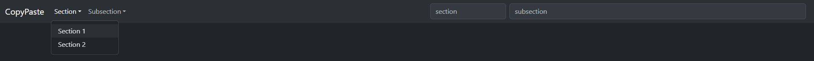
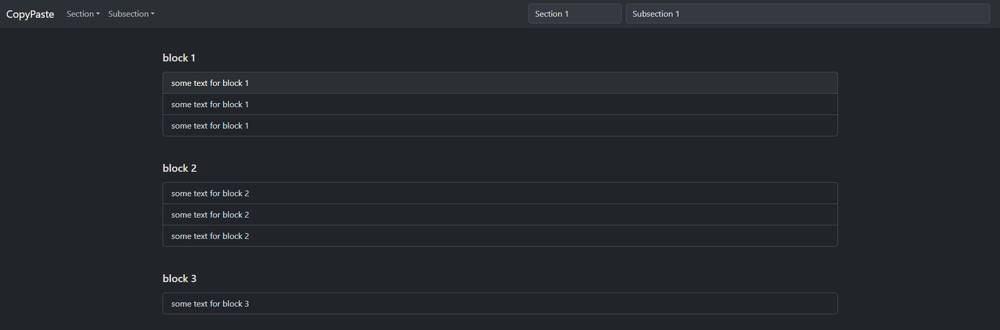

# CopyPaste
Hi there!

I created this project as a tool that I use every day when entering more complex cli commands.

So that I don't have to remember all the commands and their parameters, I created a tool where I can type these examples and then just click on the line with my mouse to automatically copy it and then I can paste it anywhere.

Anyone can use my tool and edit it further as they need to.

|||
|-|-|
| Author: | Filip Janoušek |
| Alias: | Saburo Toshiro |
| Time: | ~ 4 hours |
___

### Tutorial

> Clone the project anywhere on your pc and then open the project and open the index.html file in your browser. After opening in the browser you will see a page with a panel see picture below.


> Click on the Section dropdown in the left pane and select, for example, Section 1



> You should then see Section 1 in the first non-editable input in the panel on the right. Then click on subsection and select, for example, Subsection 1.


> After selecting a subsection, the second non-editable input on the right side should be filled in again to indicate which subsection you are currently in. At the same time, you should also see some lines with commands from the test data, which will be automatically copied to the system clipboard if you click on one.



### Example of valid JSON Schema

> Below is a generic valid json schema that you can edit and add freely in the src/assets/data.js file. It is possible to have multiple sections, each section can have multiple subsections, and each subsection can have many blocks with one or more paragraphs.

```json
{
  "sections": [
    {
      "name": "Section Name",
      "subsections": [
        {
          "name": "Subsection Name",
          "blocks": [
            {
              "title": "Block Title",
              "paragraphs": [
                "Text for paragraph 1",
                "Text for paragraph 2",
                "Text for paragraph 3"
              ]
            }
          ]
        }
      ]
    }
  ]
}
```